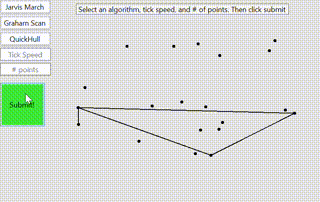

### Convex Hull Algorithm Visualization
*Pseudocode is from each algoritms respective Wikipedia page*

### Jarvis March

```
algorithm jarvis(S) is
    // S is the set of points
    // P will be the set of points which form the convex hull. Final set size is i.
    pointOnHull := leftmost point in S // which is guaranteed to be part of the CH(S)
    i := 0
    repeat
        P[i] := pointOnHull
        endpoint := S[0]      // initial endpoint for a candidate edge on the hull
        for j from 0 to |S| do
            // endpoint == pointOnHull is a rare case and can happen only when j == 1 and a better endpoint has not yet been set for the loop
            if (endpoint == pointOnHull) or (S[j] is on left of line from P[i] to endpoint) then
                endpoint := S[j]   // found greater left turn, update endpoint
        i := i + 1
        pointOnHull := endpoint
    until endpoint == P[0]      // wrapped around to first hull point
```
### Graham Scan

```
let points be the list of points
let stack = empty_stack()

find the lowest y-coordinate and leftmost point, called P0
sort points by polar angle with P0, if several points have the same polar angle then only keep the farthest

for point in points:
    # pop the last point from the stack if we turn clockwise to reach this point
    while count stack > 1 and ccw(next_to_top(stack), top(stack), point) <= 0:
        pop stack
    push point to stack
end
```

### Quickhull

```
Input = a set S of n points 
Assume that there are at least 2 points in the input set S of points

function QuickHull(S) is
    // Find convex hull from the set S of n points
    Convex Hull := {} 
    Find left and right most points, say A & B, and add A & B to convex hull 
    Segment AB divides the remaining (n − 2) points into 2 groups S1 and S2 
        where S1 are points in S that are on the right side of the oriented line from A to B, 
        and S2 are points in S that are on the right side of the oriented line from B to A 
    FindHull(S1, A, B) 
    FindHull(S2, B, A) 
    Output := Convex Hull
end function

function FindHull(Sk, P, Q) is
    // Find points on convex hull from the set Sk of points 
    // that are on the right side of the oriented line from P to Q
    if Sk has no point then
        return
    From the given set of points in Sk, find farthest point, say C, from segment PQ 
    Add point C to convex hull at the location between P and Q 
    Three points P, Q, and C partition the remaining points of Sk into 3 subsets: S0, S1, and S2 
        where S0 are points inside triangle PCQ, S1 are points on the right side of the oriented 
        line from P to C, and S2 are points on the right side of the oriented line from C to Q. 
    FindHull(S1, P, C) 
    FindHull(S2, C, Q) 
end function
```


